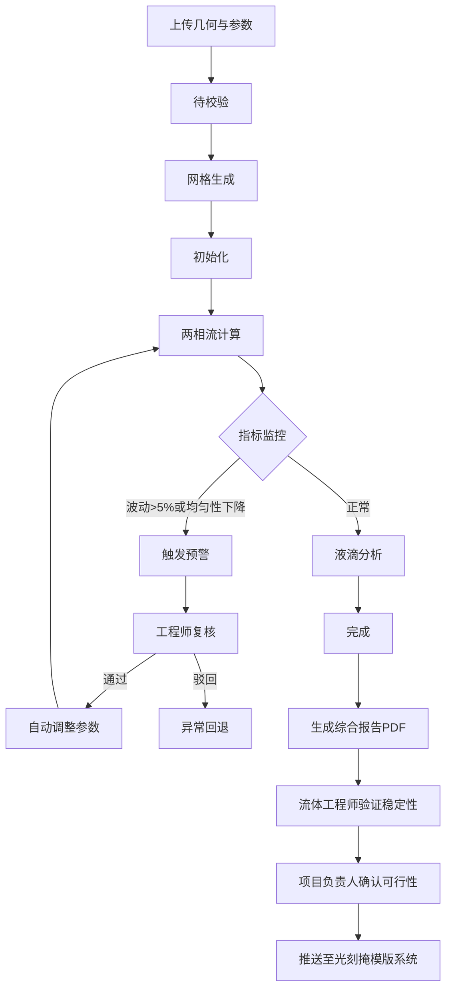

## 1. 产品概述
面向微流控工程领域的高精度多相流模拟与实验参数优化平台，支持T型/流动聚焦等微流道结构的液滴生成仿真、参数智能调优与实验审批工作流。
- 核心价值：将CFD多相流模拟与实验参数优化深度整合，通过智能推荐引擎加速单分散液滴生成工艺研发，减少物理实验迭代次数
- 目标用户：微流控工程师、流体力学研究员、项目负责人、首席科学家

## 2. 核心特性

### 2.1 用户角色
| 角色 | 权限范围 | 核心职责 |
|------|----------|----------|
| 微流控工程师 | 新建模拟、参数配置、复核预警、查看报告 | 执行模拟任务、处理异常预警、记录参数调整日志 |
| 流体工程师 | 验证模拟稳定性、提交审批 | 验证液滴生成稳定性，提交项目负责人确认 |
| 项目负责人 | 审批实验可行性、推送至光刻系统 | 确认模拟结果可用于实验，审批通过后自动推送 |
| 首席科学家 | 暂停/恢复构型、查看全局统计 | 处理连续失败构型，查看平台整体性能看板 |

### 2.2 功能模块
1. **模拟任务中心**：任务列表、状态流转可视化、新建模拟向导
2. **几何与参数配置**：微流道文件上传、流体物性参数设置、边界条件配置
3. **实时监控面板**：液滴生成频率、直径变异系数、界面形貌三维视图、压力降曲线
4. **智能预警系统**：多级预警推送、工程师复核、自动参数重调
5. **综合报告模块**：PDF报告生成、尺寸分布直方图、频率时间序列、界面演化动画
6. **数据导出中心**：按流速比/表面张力/通道宽度筛选、全场相场数据与统计导出
7. **智能推荐引擎**：基于历史模拟的最优参数推荐
8. **两级审批工作流**：流体工程师验证→项目负责人确认
9. **构型风险管理**：连续三次异常自动暂停
10. **每日统计看板**：完成率、平均变异系数、参数收敛趋势

### 2.3 页面详情
| 页面名称 | 模块名称 | 功能描述 |
|----------|----------|----------|
| 总览看板 | 统计卡片、趋势图、预警列表 | 展示每日模拟完成率、平均变异系数、参数优化收敛次数及趋势图 |
| 模拟任务中心 | 任务列表、状态时间轴、操作栏 | 展示所有模拟任务及"待校验→网格生成→初始化→两相流计算→液滴分析→完成/异常回退"状态流转 |
| 新建模拟向导 | 几何上传、参数配置、预览确认 | 分步引导用户上传微流道几何文件并配置两相流体参数 |
| 实时监控面板 | 液滴频率监控、变异系数监控、界面三维视图、压力降曲线 | 模拟过程中实时展示各项指标，波动超阈值触发预警 |
| 预警复核中心 | 预警列表、复核表单、参数调整记录 | 工程师处理预警，复核后自动调整参数并重跑 |
| 报告详情页 | 尺寸分布直方图、频率时间序列、界面演化动画、压力降曲线、PDF导出 | 模拟完成后的综合报告展示与导出 |
| 智能推荐中心 | 参数推荐卡片、历史对比、推荐理由 | 基于历史模拟推荐最优连续相流速与分散相压力组合 |
| 审批工作流 | 待审批列表、审批详情、审批操作 | 流体工程师验证稳定性，项目负责人确认实验可行性 |
| 构型风险管理 | 构型状态列表、暂停/恢复操作、异常记录 | 监控几何构型连续失败情况，自动暂停并通知首席科学家 |
| 数据导出中心 | 筛选条件、数据预览、批量导出 | 按参数维度筛选并导出全场相场数据和液滴统计 |

## 3. 核心流程
用户上传微流道几何文件与流体物性参数，系统自动构建三维两相流模型并生成自适应网格，进入状态自动流转。计算过程中实时监控液滴生成频率与尺寸变异系数，超过阈值触发多级预警推送工程师复核，复核通过自动调整参数重新模拟。模拟完成后生成PDF综合报告，经流体工程师验证稳定性和项目负责人确认可行性两级审批后，推送至光刻掩模版系统。同一构型连续三次异常则自动暂停并通知首席科学家。

## 4. 用户界面设计
### 4.1 设计风格
- **主色调**：深空蓝 `#0B1E3F` 搭配科技青 `#00D4FF`，辅以数据绿 `#00FF88` 和警示橙 `#FF6B35`
- **次要色**：中性灰阶 `#1A2744`、`#2A3A5C`、`#6B7A99`、`#C8D1E0`
- **按钮风格**：细边框圆角按钮（4px），悬停时产生辉光效果，关键操作使用渐变填充
- **字体**：标题使用 Space Grotesk 等宽科技感字体，正文使用 Inter，数据展示使用 JetBrains Mono
- **布局风格**：深色仪表盘式布局，左侧垂直导航，主内容区采用网格化卡片布局，大量使用半透明玻璃态面板
- **图标风格**：线性 Lucide 图标，配合辉光动效，数据可视化采用 ECharts 深色主题

### 4.2 页面设计概览
| 页面名称 | 模块名称 | UI 元素 |
|----------|----------|---------|
| 总览看板 | 统计卡片 | 玻璃态卡片 + 渐变数据数字 + 迷你趋势图 |
| 总览看板 | 趋势图 | 深色背景 ECharts 面积图，科技青线条 |
| 模拟任务中心 | 任务列表 | 斑马纹表格行 + 状态标签 + 进度时间轴 |
| 实时监控面板 | 三维视图 | Canvas/WebGL 液滴界面渲染，叠加参数 HUD |
| 预警复核中心 | 预警卡片 | 橙色/红色边框警示样式，倒计时指示器 |
| 报告详情页 | 图表组 | 多标签页切换 ECharts 图表，支持全屏 |
| 审批工作流 | 审批卡片 | 时间线 + 签章样式 + 审批意见气泡 |

### 4.3 响应式
采用桌面端优先设计，最小支持 1440px 宽度，次要面板可折叠适配 1024px 平板设备。

### 4.4 三维场景指导
- **环境**：深色科技感空间，微弱蓝色体积光，网格地面
- **光照**：三点布光，主光蓝色、补光青色、轮廓光白色
- **相机**：轨道控制器，默认 45° 俯视角，支持旋转缩放
- **合成**：微流道半透明蓝色，液滴使用折射材质，相场使用体渲染
