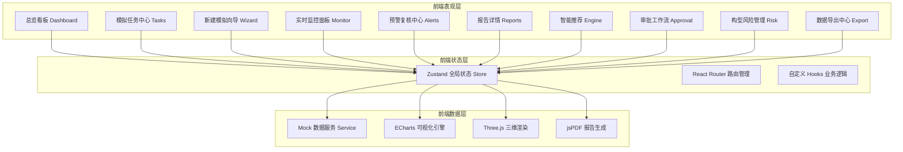
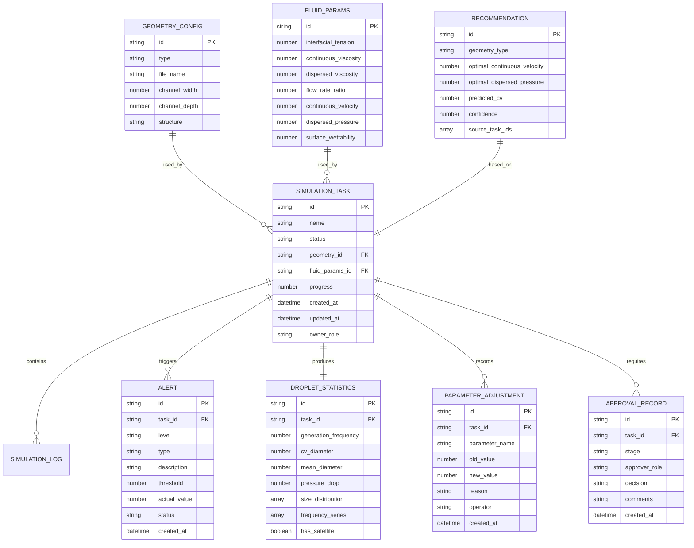

## 1. 架构设计



## 2. 技术描述
- **前端框架**：React@18 + TypeScript + Vite@5
- **样式方案**：TailwindCSS@3 + CSS 变量主题系统
- **状态管理**：Zustand
- **路由管理**：React Router DOM@6
- **数据可视化**：ECharts@5
- **三维渲染**：Three.js@0.160
- **图标库**：Lucide React
- **后端**：无（使用 Mock 数据模拟后端服务）
- **初始化工具**：vite-init

## 3. 路由定义
| 路由 | 页面组件 | 用途 |
|------|----------|------|
| `/` | Dashboard | 总览看板，展示统计数据与趋势图 |
| `/tasks` | TaskCenter | 模拟任务列表与状态流转 |
| `/tasks/new` | NewSimulation | 新建模拟向导 |
| `/tasks/:id/monitor` | RealtimeMonitor | 实时监控面板 |
| `/tasks/:id/report` | ReportDetail | 模拟报告详情与PDF导出 |
| `/alerts` | AlertCenter | 预警复核中心 |
| `/recommend` | RecommendEngine | 智能参数推荐 |
| `/approval` | ApprovalWorkflow | 两级审批工作流 |
| `/risk` | RiskManagement | 构型风险管理 |
| `/export` | DataExport | 数据导出中心 |

## 4. 数据模型

### 4.1 核心数据定义



### 4.2 状态枚举定义

```typescript
type SimulationStatus = 
  | 'pending_verify'
  | 'mesh_generation'
  | 'initialization'
  | 'two_phase_computing'
  | 'droplet_analysis'
  | 'completed'
  | 'error_fallback';

type AlertLevel = 'warning' | 'critical' | 'fatal';
type AlertStatus = 'pending' | 'reviewing' | 'approved' | 'rejected';
type ApprovalStage = 'engineer_verify' | 'manager_confirm';
type ApprovalDecision = 'pending' | 'approved' | 'rejected';
```
